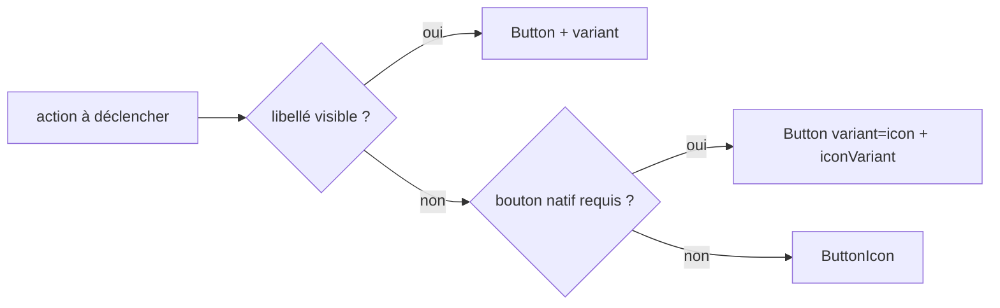

# Spec — Boutons (@jointhedots/button)

Le package button fournit les déclencheurs d'action du système : `Button`
(le bouton natif habillé) et `ButtonIcon` (la pastille d'action). Les deux
rendent au-dessus des tokens `--jtd-*` du thème et des glyphes
d'@jointhedots/icon — aucune feuille tierce n'est requise, les styles sont
injectés au chargement du module.

## Le bouton

Un bouton porte une **variante** — sa nature sémantique : `neutral` (défaut),
`primary`, `outline-primary`, `success`, `warning`, `error`, `text-error`,
`link`, `base` (nu) et `icon` (icône seule). Tout variant coloré suit la
palette sémantique du thème ; le texte posé sur un remplissage saturé est
toujours `--jtd-on-emphasis`. La base est transparente : un variant sans
remplissage ne montre jamais le fond natif du `<button>`. `inverse` inverse
le contraste pour un usage sur fond sombre — bouton et glyphe suivent.

Une **icône** optionnelle accompagne le libellé, à gauche (défaut) ou à
droite. Le glyphe hérite toujours de la typographie du bouton (1em, aligné
sur le texte), comme les lignes de menu et les champs.

## La taille

Un bouton expose une **taille** — `xs`, `sm`, `md` (défaut), `lg`, les
mêmes déclinaisons que les icônes et les champs. La taille est une
métrique, pas une variante : elle met à l'échelle le bouton entier
(hauteur, police, espacements, rayon) sans toucher à sa nature, et le
glyphe suit par héritage de la fonte. Ses métriques sont celles du
composite de champ de @jointhedots/input : un bouton posé à côté d'un
champ de même taille partage sa hauteur. Le bouton-icône dérive sa boîte
de la même taille ; le variant `link` ne retient que la typographie.

## Le bouton-icône

`variant="icon"` rend un carré cliquable sans libellé visible. Sa
**présentation** (`iconVariant`) dit comment l'icône s'habille : `bare`
(glyphe nu, halo au survol), `container` (pastille de fond), `border` et
`border-filled` (contour, à plat ou rempli), `primary` (pastille
`--jtd-primary`), `more` (chevron de débordement, rendu nu) et
`global-header` (bouton d'entête globale, rendu en pastille). Sur fond
sombre, `inverse` adapte chacune de ces présentations.

## Tooltip

Quand `tooltip` reçoit un node, le bouton est enveloppé et une bulle
s'affiche au survol ou au focus clavier (délai ~350 ms, contenu riche
autorisé). La bulle suit la grammaire visuelle des popovers du layout :
surface, filet, flèche dont le contour prolonge celui de la bulle. Pour
une infobulle simple, `title` reste la voie native.

## Focus et accessibilité

Le focus clavier rend un anneau `--jtd-primary` (`:focus-visible`). Le
focus programmatique passe par `requestFocus` + `onRequestFocus`, la
référence par `buttonRef`. `assistiveText` devient le libellé lecteur
d'écran (`aria-label`) ; pour un bouton-icône sans `assistiveText`, un
libellé chaîne est promu. Tout prop `aria-*`, `data-*` et de formulaire
est transmis à l'élément natif.

## La pastille d'action

`ButtonIcon` est l'autre déclencheur du package : un conteneur focusable
pour les actions internes d'interface (tooling d'items, barres d'outils),
plutôt qu'un `<button>` natif. Sa pastille circulaire est dimensionnée
par la fonte (`1.8em`) — la taille se pilote donc par `font-size`, valeur
brute ou alias d'`IconSize`. Ses variantes `primary`, `neutral` et
`watermark` couvrent l'action affirmée, discrète et fugitive. Quand
`hoveredIcon` est fourni, la bascule repos/survol est systématiquement
fondue — l'état se lit sans coup sec.

## Frontières

`button` dépend d'`icon` (glyphes) et consomme les tokens du thème. La
dépendance est unidirectionnelle : `layout` consomme `ButtonIcon` pour le
tooling des items, jamais l'inverse, et le graphe reste
`theme → icon → button → layout`, `icon → input → layout`.
