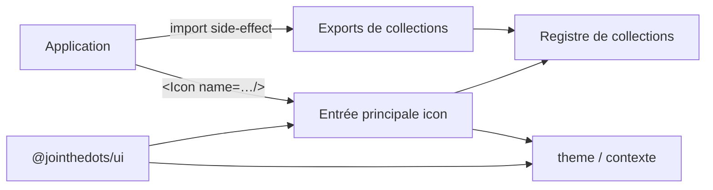

# Spec — Icônes et thème

## Vue d'ensemble

L'affichage d'icônes repose sur deux packages :

- **@jointhedots/icon** — le système d'icônes : composant de rendu, langage de
  nommage, registre de collections.
- **@jointhedots/theme** — le contrat d'éclairage de l'interface : thème global
  clair/sombre, thème contrasté, contexte React, chargement des styles de base.

## Le concept d'icône

Une icône n'est pas une image : c'est une **composition** décrite par une
chaîne de nom. La chaîne désigne un ou plusieurs **éléments**, chacun résolu
dans une **collection** identifiée par son namespace. Les éléments sont rendus
en calques superposés dans une boîte unitaire de 1em — la taille de l'icône est
pilotée par la seule `font-size` du conteneur.

Le placement des calques dans la boîte relève du composant, pas des
collections : il est appliqué en styles inline et ne peut donc pas être
contesté par les feuilles de style tierces que les collections chargent.

La chaîne se décompose en :

- des **options de base**, préfixées entre crochets, appliquées au conteneur ;
- une suite d'éléments séparés par `|`, chacun de la forme
  `namespace:glyph[options]`.

Les options (base ou élément) combinent :

- des **drapeaux** : couleurs sémantiques (`error`, `warn`, `info`, `primary`,
  `secondary`, `success`) qui suivent la palette du thème — les drapeaux
  colorés consomment les tokens `--jtd-*` (le gris de `info`/`secondary` est
  le ton `muted`) — et réduction-positionnement en pastille (`badge`,
  coins `RT`/`RB`/`LT`/`LB`) ;
- des **variables CSS** `clé=valeur`, exposées à la collection sous forme de
  custom properties.

Invariants du langage :

- un namespace inconnu ou un nom invalide produit le glyph d'erreur (collection
  `?`) — jamais d'exception ;
- une valeur `undefined`/`null` rend l'icône vide (`blank`), une valeur numérique
  est convertie en label ;
- une même chaîne de nom est parsée une seule fois puis mémoïsée.

## Le registre de collections

Les collections sont enregistrées dans un registre global du package icon,
clé par namespace. Le package est **singleton** : un seul registre existe à
l'exécution, peu importe le nombre de points d'import.

Deux familles d'entrées :

- l'**entrée principale** expose le composant, les types, les classes de
  collections génériques (police CSS, sprites SVG, images par URL) et garantit
  l'enregistrement des collections intégrées : `blank`, `?` (erreur), `data`
  (URL relative), `avatar` (pastille déterministe : teinte issue d'un hash du
  nom, initiales), `label` (pastille à valeur brute) ;
- les **exports de collections dédiées** — un export par famille d'assets
  (bootstrap, font-awesome, flag-icons, salesforce) — s'importent pour leur
  effet de bord : chargement des assets (police, sprite) et enregistrement du
  ou des namespaces. L'application choisit précisément ce qu'elle embarque.

Une collection est un couple de responsabilités : **préparer** un élément une
fois parsé (classes, styles, données dérivées), puis le **dessiner** à chaque
rendu, en fonction du thème courant.

## Le contrat theme

Le package theme définit :

- un **éclairage** (clair/sombre) porté par un objet thème global ;
- un **thème contrasté** associé à chaque thème ;
- un **contexte React** permettant de surcharger le thème dans un sous-arbre ;
- le chargement des styles de base de l'interface.

Les collections sensibles à l'éclairage choisissent leur variante (claire ou
sombre) selon le thème reçu au dessin. Une collection par sprite déclare sa
relation à l'éclairage sombre de trois manières : un sprite sombre dédié (le
dessin bascule de sprite), un sprite unique réutilisé à l'identique (icônes
auto-colorées, correctes dans les deux éclairages), ou l'absence de variante
sombre — le sprite clair est alors réutilisé et son rendu inversé par filtre
CSS dans l'éclairage sombre. Salesforce illustre les trois cas : les glyphes
`utility`, monochromes et conçus pour un fond clair, n'ont pas de variante
sombre et sont inversés ; les collections `standard`, `custom`, `action` et
`doctype` portent leurs propres couleurs et réutilisent leur sprite à
l'identique. Le prop `inverse` du composant bascule sur le thème contrasté,
pour les icônes posées sur un fond inversé.

## Frontières

- `@jointhedots/icon` dépend de `@jointhedots/theme` et n'a aucune dépendance
  vers les composants d'interface.
- `@jointhedots/ui` consomme les deux ; il n'expose plus d'icônes ni de thème
  par lui-même.
- Une application déclare les collections qu'elle veut rendre disponibles en
  important les exports dédiés ; toute icône référencée sans collection
  correspondante affiche le glyph d'erreur.
