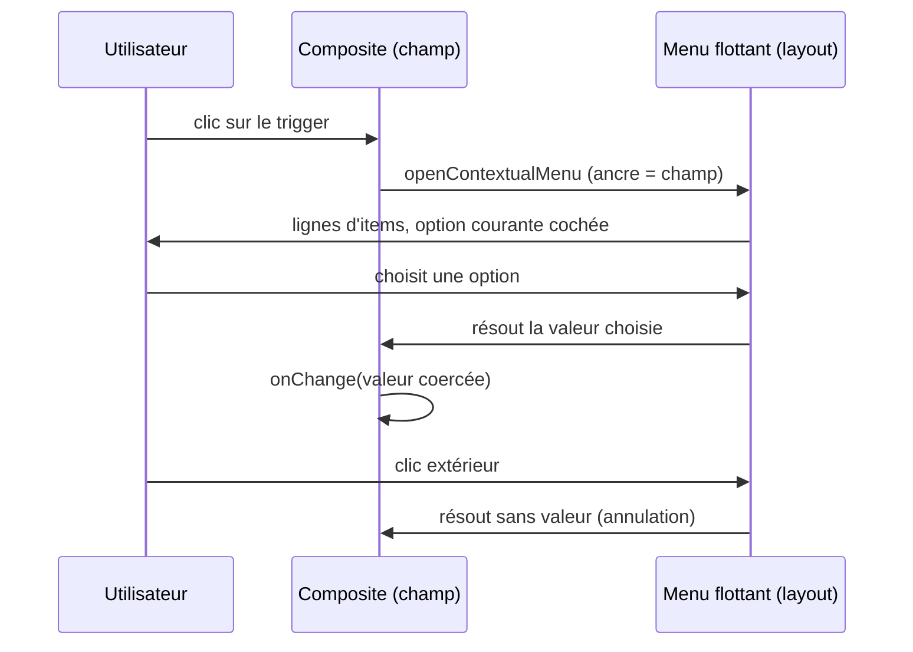

# Spec — Champs de saisie (@jointhedots/input)

Le package input fournit le champ de saisie du système : `InputData`,
piloté par un schéma JSON. Il n'existe qu'une seule famille de gabarits
(`jtd-field*`), habillée par les tokens `--jtd-*` du thème — tout champ
passe par le schéma, y compris le champ texte simple.

## Le champ

Un champ est un libellé optionnel au-dessus d'un **composite** : la boîte
bordée qui enveloppe l'icône gauche, le widget de saisie et le tooling
droit. Le composite est la source unique de la hauteur du champ ; les
widgets intérieurs sont nus (ni bordure ni fond) et le focus se lit sur la
boîte. Le schéma `boolean` échappe au composite : une coche seule dans une
boîte bordée serait du bruit, la checkbox est donc rendue nue.

Un champ expose une **taille** — `xs`, `sm`, `md` (défaut), `lg`, les
mêmes déclinaisons que les icônes. La taille met à l'échelle le composite
(hauteur, police, espacements) ; par héritage de la fonte, tout ce qu'il
contient suit — icône, pastilles de tooling, chevron du déroulant, texte
du widget. Elle ne change ni le widget choisi par le schéma, ni son
comportement : c'est une métrique, pas une variante.

## Pilotage par schéma

`InputData` est entièrement contrôlé (`value` + `onChange`) et ne décide
rien seul : c'est le `JSONSchema` (@jointhedots/core) qui choisit le widget
— texte, nombre, zone de texte, coche ou choix restreints. Le changement
coerce la valeur au type du schéma : un schéma numérique produit toujours
un nombre, jamais sa représentation textuelle. Le schéma est un contrat de
données, pas une suggestion.

Deux champs du schéma pilotent le rendu fin d'un champ texte : son
`format` devient le type du contrôle natif (les formats de chaîne
s'alignent sur les types d'input HTML — `email`, `password`, `search`,
`tel`… ; `textarea` seul désigne la zone multi-ligne), et sa valeur
`default` est le texte fantôme du champ vide — le défaut d'un champ texte
est sa suggestion.

## Choix restreints (enum)

Un schéma à énumération ne rend pas de liste HTML native : le déroulant
est une instance du **modèle d'items** de @jointhedots/layout. Le trigger
est un bouton du composite affichant la valeur courante et un chevron ;
son ouverture affiche un menu contextuel flottant ancré sous le champ,
dont chaque option est une ligne compacte d'item (`Menu.Item`). L'option
courante est marquée d'une coche, les autres d'un espace vide ; choisir
une option ferme le menu puis propage la valeur ; annuler (clic
extérieur, fermeture) laisse la valeur inchangée.

## Tooling du champ

Les actions d'un champ suivent exactement le **modèle de tooling** du
système d'items : chaque action est un `ToolingProps` (un `LabelProps`
augmenté du drapeau `optional`), défini dans @jointhedots/layout. Le
tooling d'un champ, d'une ligne d'item ou d'un panneau partage donc le
même vocabulaire — `name`, `icon`, `summary`, `onActivate(label, dock)` —
et le même rendu délégué : pastilles activables, les entrées
`optional` étant regroupées derrière un bouton de débordement.
`onActivate` reçoit un dock flottant ancré à la source du clic, ce qui
permet à une action de champ d'ouvrir un menu ou une bulle sans
positionnement à sa charge.

## Le constructeur de champ texte

Construire à la main le schéma d'un champ texte (type, format, défaut)
répète de la connaissance du rendu chez l'appelant. Le constructeur
`TextInputSchema(placeholder, type)` la centralise : il reçoit le texte
fantôme et le type de contrôle HTML, et produit le schéma qui rend sur
`InputData` le champ texte correspondant. Le champ texte simple n'est donc
pas un composant distinct — c'est un point de vue sur le schéma.

## Frontières

`input` dépend de `core` (le type `JSONSchema`), d'`icon` (glyphes) et de
`layout` (modèle d'items, menus flottants). La dépendance est
unidirectionnelle : `layout` ne connaît jamais les champs, et le graphe
reste `theme → icon → button → layout`, `icon → input → layout`.
