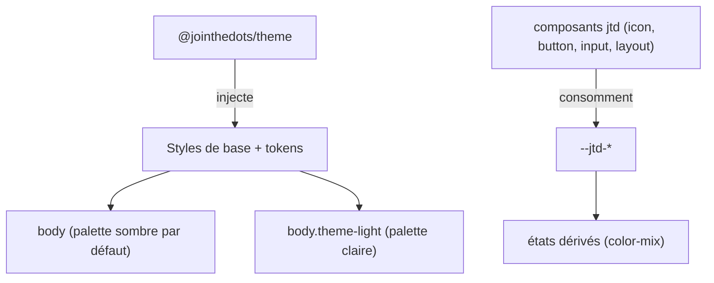

# Spec — Thème et tokens de design

## Vue d'ensemble

Le package **@jointhedots/theme** est la couche de base visuelle de la
bibliothèque : il possède le modèle d'éclairage (clair/sombre), le contexte
React de thème, et le **jeu de tokens de design** — l'unique source de couleur
et de typographie de tous les composants.

## Le concept de token

Un token est une variable CSS `--jtd-*` nommée par son rôle sémantique dans
l'interface, jamais par sa valeur. Le jeu complet est volontairement minimal —
chaque token doit être consommé par au moins un composant :

- fonds et textes : la page (`background`, `foreground`) et les surfaces
  élevées — popovers, menus, champs, panneaux (`surface`,
  `surface-foreground`) ;
- `border` : le filet hairline unique des bordures et séparateurs ;
- `muted` : texte secondaire ; `hover` : teinte de survol ;
- la **palette sémantique** : `primary` (l'interactif — actions primaires,
  focus, marqueur de sélection), `success`, `warning`, `error`, et
  `on-emphasis` — le texte posé sur tout remplissage saturé de la palette ;
- `font-family` : police de l'interface.

La palette est la seule source de colorisation : tout composant coloré
(bouton plein ou contouré, pastille d'action, drapeau d'icône) consomme
l'un de ces cinq tokens — jamais une couleur littérale. Le même rôle
s'appelle toujours pareil : la couleur d'action est `primary` du token au
variant de bouton au drapeau d'icône. Ce qui n'est pas coloré est
`neutral` (chrome de surface, filet, survol doux) — ce n'est pas un
membre de la palette.

Invariants :

- un composant ne porte jamais de couleur littérale : il consomme un token ou
  dérive un état par mélange (`color-mix`) — dériver vaut mieux que multiplier
  les tokens ;
- la valeur d'un token peut changer (thème, re-thémage d'un sous-arbre), sa
  signification jamais ;
- `color-scheme` suit l'éclairage pour aligner les contrôles natifs.

## Thème global et éclairage

Le sombre est la palette par défaut de `body` ; la classe `theme-light`
installée par le chargeur de thème bascule l'ensemble des tokens et le
`color-scheme`. Le choix initial suit : préférence persistée de
l'utilisateur, puis préférence système, puis sombre. Le contexte React et le
thème contrasté (`contrastTheme`) permettent aux composants de s'inverser sur
un fond opposé sans connaître la palette.

Re-thémer un sous-arbre consiste à redéfinir les tokens sur un conteneur —
aucun composant n'a besoin d'être informé.

## Frontières des couches de styles

- **Styles de composant** : compilés au build puis injectés au runtime par
  chaque package (balise `<style>` idempotente). Ils ne contiennent que des
  gabarits `jtd-*` consommant des tokens.
- **Styles d'assets tiers** : importés littéralement, résolus par le
  bundler de l'application. Une seule subsiste : la feuille Salesforce,
  importée par l'export de collections `salesforce` d'@jointhedots/icon car
  elle porte les couleurs des sprites — nulle part ailleurs.
- Les surcouches d'application (playground) stylent la page et consomment les
  mêmes tokens.

## Flèche de popover : cohérence du contour

Les bulles fléchées (popover du layout, tooltip du bouton) partagent une
grammaire unique : la bulle est une surface opaque au filet hairline ; la
flèche est un losange bordé peint **derrière** le corps opaque, à cheval sur
le bord. La moitié interne du losange et ses bords intérieurs sont masqués par
le corps ; seuls émergent la pointe et les deux bords extérieurs, qui
prolongent visuellement le filet de la bulle — sur chacun des quatre côtés
porteurs, sans déclinaison directionnelle en CSS.
